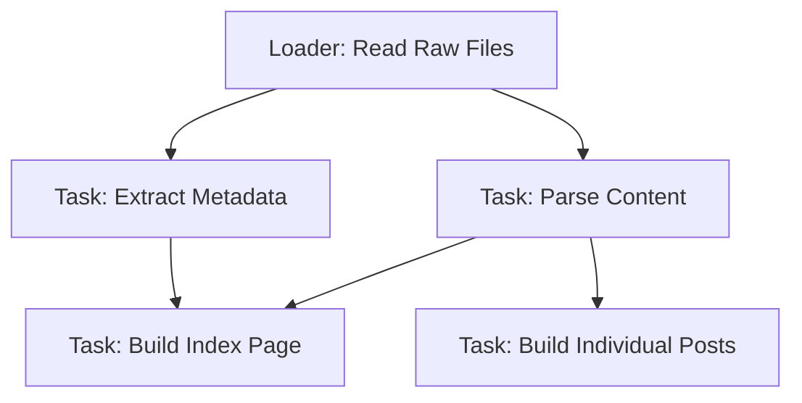
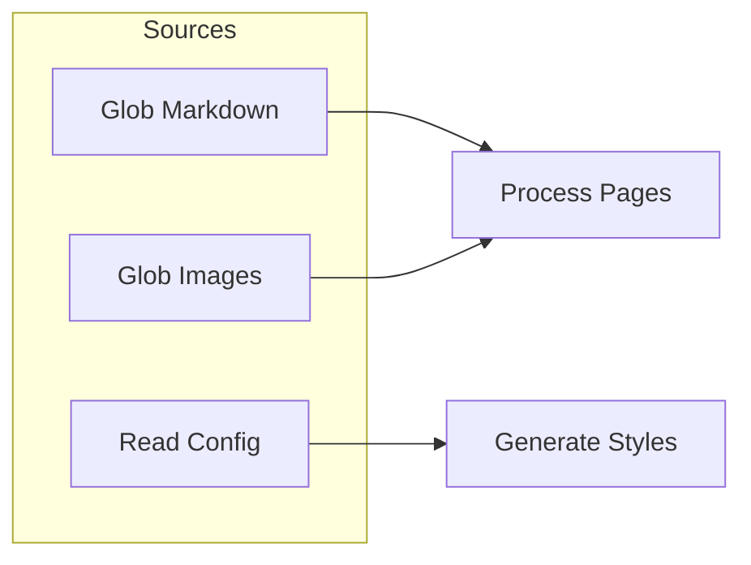
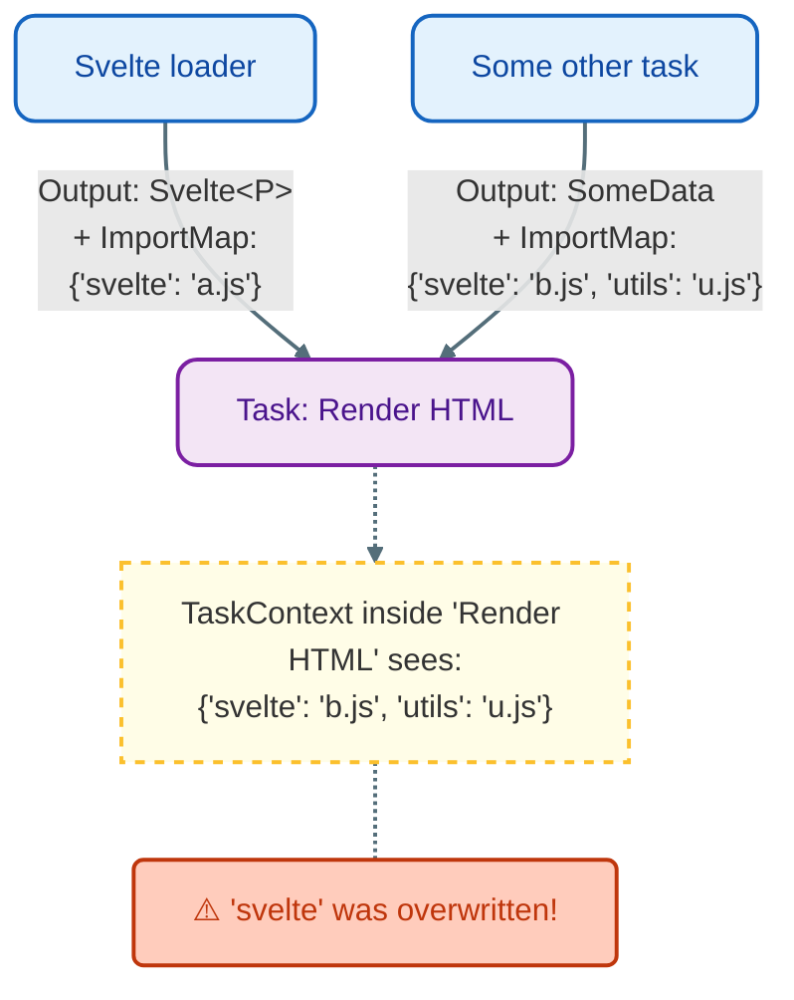

# Library architecture

`hauchiwa` is a static site generator library built around a strictly typed,
parallel task graph. Unlike traditional generators that often have fixed
pipelines (e.g., "read all files" -> "process markdown" -> "render templates"),
`hauchiwa` allows users to define an arbitrary Directed Acyclic Graph (DAG) of
tasks.

## The core task graph

The heart of the library is a dependency graph where:
* **Nodes** are `Task`s: units of work that produce a specific output.
* **Edges** represent dependencies: Task A needs the output of Task B to run.

While the internal graph stores tasks dynamically (type-erased), the API exposed
to the user is strictly typed.
* A `Task` is defined by a closure or struct.
* It accepts a global context and inputs from its dependencies.
* It produces a typed output (e.g., `Vec<Page>`, `CssBundle`, `Image`).

This system ensures that if Task B depends on Task A, Task B receives exactly
the type returned by Task A. The compiler enforces this relationship.

When a task is added to the graph, the system returns a `Handle<T>`. This handle
is a lightweight reference (a token) representing the future result of that
task.

To make Task B depend on Task A:
1. Define Task A. It returns a `Handle<OutputA>`.
2. Pass that handle to Task B's definition.
3. The execution engine ensures Task A runs first, and its result is passed to
   Task B.

## Visualizing the Graph

One of the powerful features of this architecture is the ability to handle
"diamond dependencies" efficiently. This occurs when two different tasks depend
on the same shared ancestor. The execution engine guarantees the ancestor is run
exactly once, and its result is shared.

In this example:
1. `Loader` reads files once.
2. `Extract Metadata` and `Parse Content` both use the raw file data.
3. `Build Index Page` needs both metadata (to list dates) and content (for
   snippets).

There is no special "loading phase" in `hauchiwa`. "Loaders" are simply tasks
that happen to have **zero dependencies**. They act as the source nodes (roots)
of the graph. 

It is important to note that *any* task can have zero dependencies. Loaders are
just the most common example because they naturally don't depend on other tasks;
instead, they typically interact with the outside world (the filesystem) to
bring data into the graph.

## `ImportMap` propagation

In modern web development, particularly when using ES modules in the browser,
managing import paths (e.g., `import { X } from "..."`) is critical. `hauchiwa`
automates this via importmap propagation.

While a `Handle<T>` ensures the type-safe flow of outputs (the Rust structs),
tasks can also produce a side-channel of information: the `ImportMap`.

1. When a Loader (like `load_svelte`) processes a file, it registers the
   resulting artifact in its internal Store. Example: Register
   `"components/Button.svelte"` -> `"/hash/d41d8cd9.js"`

2. When Task B depends on Task A, the execution engine automatically merges Task
   A's import map into Task B's context.

3. Task B (e.g., a page renderer) receives a TaskContext containing the
   pre-merged ImportMap. It can then serialize this map into the `<head>` of the
   generated HTML.

This means you do not need to manually pass ambient runtime asset paths through
your task functions. Simply declaring a dependency on a Svelte task and
including the `importmap` is enough to make the required `"svelte"` modules
available in the browser.

If multiple dependencies provide different values for the exact same key, the
merging strategy is left undefined. Consequently, you cannot rely on a specific
order of precedence. You must ensure keys are unique or that collisions are
intentional and identical. In practice this should not matter, but it's
important to be aware of this behavior.

## Execution Model

The execution engine (`executor.rs`) manages the lifecycle of the build:

1. **Topological Sort:** The graph is analyzed to determine the execution order
and detect cycles.
2. **Parallel Execution:** Tasks are scheduled on a thread pool. A task is ready
to run as soon as all its dependencies have finished.
3. **Caching:** Results of tasks are cached in memory.

Because the build is a graph, `hauchiwa` can perform smart incremental builds.
When a file changes:
1. The system identifies which "Loader" task is responsible for that file.
2. It marks that task and all its descendants as "dirty".
3. Only the dirty subgraph is re-executed. Unaffected parts of the site are
    preserved.
