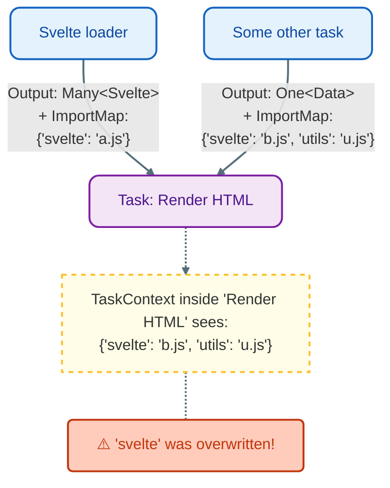

# Architecture

`hauchiwa` is a static site generator library built around a strictly typed,
parallel task graph. Unlike traditional generators that often have fixed
pipelines (e.g., "read all files" -> "process markdown" -> "render templates"),
`hauchiwa` allows users to define an arbitrary Directed Acyclic Graph (DAG) of
tasks.

## task graph

The heart of the library is a dependency graph where:

* **Nodes** are `Task`s: units of work that produce outputs.
* **Edges** represent dependencies: Task A needs the output of Task B to run.

While the internal graph stores tasks dynamically (type-erased), the API exposed
to the user is strictly typed. The compiler ensures that if Task B depends on
Task A, Task B receives exactly the type returned by Task A.

### Granularity: One vs. Many

A key feature of `hauchiwa` is its support for dual granularity. Tasks are
categorized based on their output structure, and the system provides distinct
handles for each:

1. **Coarse-grained**: These tasks produce a single unit of output. This is typical for
   aggregation steps, such as building a global sitemap, or rendering a single
   index page.
  * **Handle**: `One<T>` represents a future value of type `T`.
  * **Example**: `One<String>`, `One<Vec<Output>>`.


2. **Fine-grained**: These tasks produce a collection of outputs, usually keyed
   by a file path or identifier. This is typical for "Loaders" that process
   multiple files (e.g., all markdown files in a directory).
  * **Handle**: `Many<T>` represents a future collection of values of type `T`.
  * **Example**: `Many<Document>` (representing `n` blog posts).

When you define a task, the handle you receive (`One` or `Many`) dictates how
downstream tasks can consume that data.

### Defining dependencies

To make Task B depend on Task A:

1. Define Task A. It returns a handle (e.g., `One<OutputA>`).
2. Pass that handle to Task B's definition using `.depends_on(handle)`.
3. The execution engine ensures Task A runs first, and its result is passed to Task B.

```rust
// Conceptual Example
let posts: Many<Post> = blueprint.load_posts(); // Task A (Fine)
let index: One<Html>  = blueprint.task()        // Task B (Coarse)
    .depends_on(posts)
    .run(|ctx, posts| { ... }); 

```

## Visualizing the graph

The architecture efficiently handles "diamond dependencies," where two different
tasks depend on the same shared ancestor. The execution engine guarantees the
ancestor is run exactly once.

```mermaid
graph TD
    RawFiles[Loader: Read Raw Files (Many)] --> Meta[Task: Extract Metadata (Many)]
    RawFiles --> Content[Task: Parse Content (Many)]
    
    Meta --> Index[Task: Build Index Page (One)]
    Content --> Index
    Content --> Post[Task: Build Individual Posts (Many)]

```

In this example:

1. `Loader` reads files once.
2. `Extract Metadata` and `Parse Content` both use the raw file data.
3. `Build Index Page` aggregates the metadata (to list dates) and content.

### Loaders and Sources

There is no special "loading phase" in `hauchiwa`. "Loaders" are simply tasks
that act as the source nodes (roots) of the graph. They typically produce
`Many<T>` handles because they introduce multiple items (files) into the graph
from the filesystem.

```mermaid
graph LR
    subgraph Sources
        L1[Glob Markdown (Many)]
        L2[Glob Images (Many)]
        L3[Read Config (One)]
    end
    
    L1 --> T1[Process Pages]
    L2 --> T1
    L3 --> T2[Generate Styles]

```

## `ImportMap` Propagation

In modern web development, particularly when using ES modules in the browser,
managing import paths (e.g., `import { X } from "..."`) is critical. `hauchiwa`
automates this via `ImportMap` propagation.

While handles (`One<T>`, `Many<T>`) ensure the type-safe flow of Rust data
structures, tasks can also produce a side-channel of information: the
`ImportMap`.

1. **Registration**: When a Loader (like `load_svelte`) processes a file, it
   registers the resulting artifact in its internal `Store`.
  * Example: Register `"components/Button.svelte"` -> `"/hash/d41d8cd9.js"`

2. **Propagation**: When Task B depends on Task A, the execution engine
   automatically merges Task A's import map into Task B's context.

3. **Consumption**: Task B (e.g., a page renderer) receives a `TaskContext`
   containing the pre-merged `ImportMap`. It can then serialize this map into
   the `<head>` of the generated HTML.

This means you do not need to manually pass ambient runtime asset paths through your task functions. Simply declaring a dependency on a Svelte task is enough to make the required modules available to the browser.



## Content-Addressable Storage (CAS)

`hauchiwa` utilizes a content-addressable storage model for managing generated
assets (like compiled JavaScript, CSS, or optimized images). This is handled via
the `Store` struct passed to task callbacks.

Instead of managing file names manually (e.g., `bundle.js`), tasks pass raw bytes to the store:

```rust
// In a task callback
let path = store.save(my_data, "js")?;
// returns "/hash/a1b2c3d4.js"

```

The store calculates a cryptographic hash (BLAKE3) of the content and saves the
file to a global `/hash/` directory.

### Benefits:

1. **Immutable cache**: Since the filename is derived from the content, any
   change results in a new filename, allowing browsers to cache assets
   indefinitely.
2. **Deduplication**: If multiple tasks produce the exact same output, it is
   stored only once on disk.
3. **Atomicity**: Assets are fully written before they are referenced,
   preventing race conditions.

## Execution Model

The execution engine manages the lifecycle of the build:

1. **Analysis**: The graph is analyzed to determine execution order and detect
   cycles.
2. **Scheduling**: Tasks are scheduled on a thread pool (via `rayon`). A task is
   ready to run as soon as all its dependencies have finished.
3. **Caching**: Results of tasks are cached in memory.

### Incremental Builds

Because the build is a graph, `hauchiwa` performs smart incremental builds. When
a file changes:

1. The system identifies which "Loader" task is responsible for that file.
2. It marks that task and all its descendants as "dirty".
3. Only the dirty subgraph is re-executed. Unaffected parts of the site are preserved.

### Global Environment

All tasks have access to a global `Environment`, which contains:

* **Mode**: Whether the site is in `Build` or `Watch` mode.
* **Generator info**: Metadata about the generator.
* **User data**: Custom global data defined by the user (e.g., site configuration).
